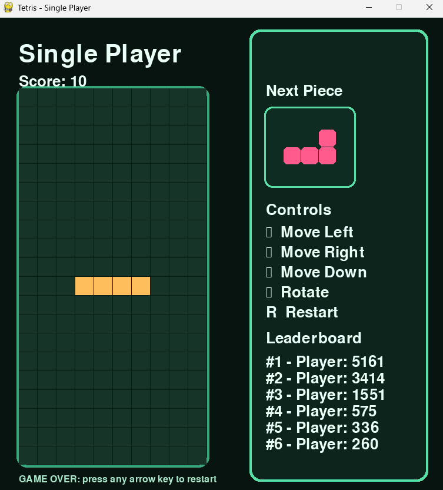

# ReadMe

## 1. Which package/library does the sample program demonstrate?
This program demonstrates the use of pygame and pandas in python programming language. 
Pygame is used to build the Tetris game interface, handle keyboard input, and display graphics, while Pandas is used to store and manage leaderboard scores in a CSV file.

## 2. How does someone run your program?
The libraries pygame and pandas need to  installed first before running the code, and all the project files need to be kept in the same folder. Then the program can be ran from the terminal in that folder and typing `python main.py`.

## 3. What purpose does your program serve?
The purpose of this program is to provide a playable single-player Tetris game with score tracking and a leaderboard. It allows the user to move, rotate, and place tetromino pieces while trying to clear rows and earn points.

## 4. What would be some sample input/output?
Sample input includes pressing the arrow keys to move or rotate the falling pieces and pressing `R` to restart the game. The output is a graphical Tetris window that shows the board, next piece preview, score, leaderboard, and a game-over popup when the board fills up.

